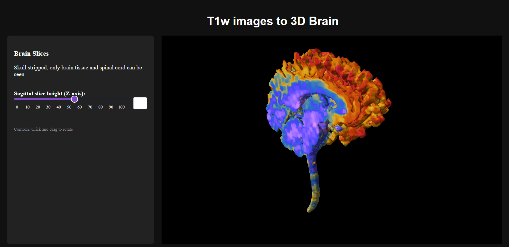

# 3D Brain Data Dashboard

A Python-based interactive web dashboard built with **Dash** and **Plotly** for visualising 3D MRI brain scans (`.nii.gz`). This project was developed as a final project for data handling, featuring custom skull-stripping, downsampling, and dynamic 3D surface rendering using the Marching Cubes algorithm.

---

## Features

* **Interactive 3D Visualisation:** Render realistic 3D brain models with smooth shading and custom colour scales.
* **Sagittal Slice Slider:** Dynamically slice through the brain volume along the Z-axis in real-time.
* **Automated Skull Stripping:** Basic programmatic skull-stripping pipeline using thresholding, morphological erosion/dilation, and connected-component labeling.
* **Dark Mode UI:** Clean, modern dashboard layout optimised for scientific imaging.

---


## Demo & Preview

### Dashboard Screenshot


### Video Walkthrough
*[click here to view the video](3dbrain.mp4)*

## Prerequisites & Dependencies

Make sure you have Python installed along with the required libraries:

```bash
pip install numpy nibabel dash plotly scikit-image scipy

```

---

## Project Structure & Workflow

1. **Data Loading:** Loads the NIfTI file (`.nii.gz`) using `nibabel`.
2. **Preprocessing:**
* Handles 4 dimensions if present.
* Downsamples the volume (every 2nd voxel) to optimize performance.
* Normalises voxel intensity values between `0` and `1`.


3. **Skull Stripping:** Removes non-brain tissue (such as skin and background) using mathematical morphology and isolates the largest connected component.
4. **Dashboard App:** Initialises a local Dash server where `marching_cubes` extracts the 3D surface mesh based on the user-controlled slider position.

---

## Getting Started

1. Clone or download this repository.
2. Update the file path in the script to point to your local `.nii.gz` dataset:
```python
NIFTI_PATH = r"C:\Your\Path\To\File.nii.gz"

```


3. Run the script:
```bash
python your_script_name.py

```


4. Open your web browser and navigate to the local link provided in the terminal:
```text
http://127.0.0.1:8050/

```


---

## Controls

* **Rotation:** Click and drag inside the 3D graph to rotate the brain model.
* **Slicing:** Use the slider on the left panel to peel back or reveal layers of the brain along the Z-axis.
